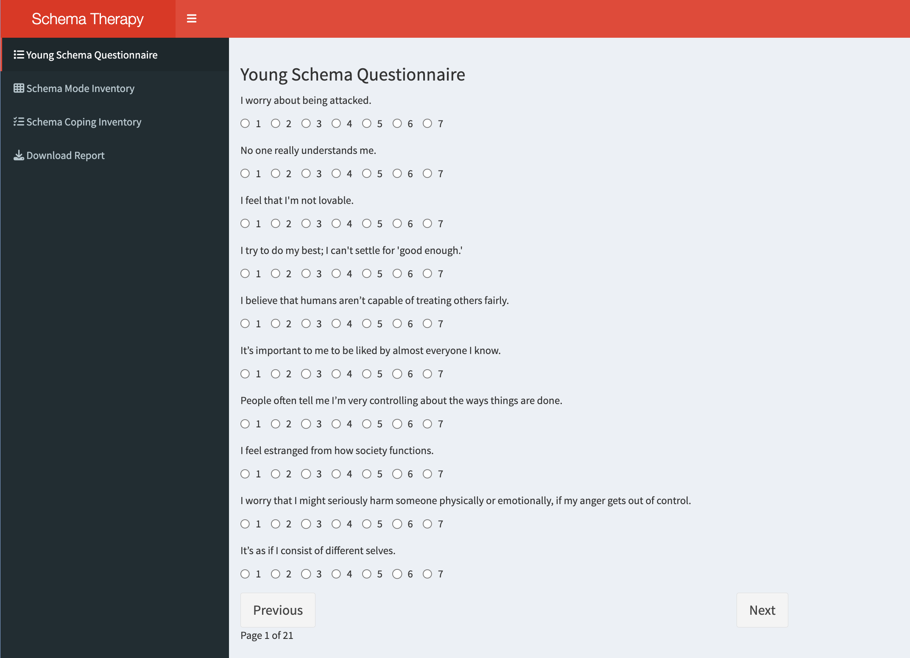
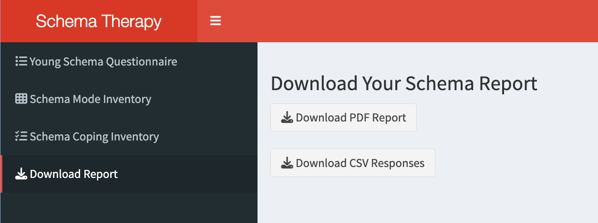

```{r, include = FALSE}
knitr::opts_chunk$set(
  collapse = TRUE,
  comment = "#>"
)
```

```{r setup}
library(intakegui)
```

# Introduction

This vignette documents the Schema Therapy Intake Shiny App, part of the 
`intakegui` R package. The app allows service-users to complete the latest 
versions of the Young Schema Questionnaire (YSQ), the Schema Mode Inventory (SMI), 
and the Schema Coping Inventory (SCI). Moreover, it automatically generates both 
CSV and PDF reports summarizing responses and scores, which allow the patient to
get an overview of the schema concepts and of their own scores before the session
with their therapist in which these concepts will be discussed.

# Features of the App

The application consists of four main tabs: Young Schema Questionnaire (YSQ),
Schema Mode Inventory (SMI), Schema Coping Inventory, and Download Report. Users 
must complete all questions of the first questionnaire before accessing the 
following one, and all questionnaires must be fully completed before downloading 
a report. 

The UI is built using `shinydashboard` and enhanced with `shinyjs` for 
interactivity. Responses are aggregated by schema (for YSQ), schema mode 
(for SMI) and schema coping style (for SCI). This is how the UI looks like:


The app then provides a mean score for each schema, mode, and coping style, for 
each patient using the get_score function from the `intakegui` package.

```{r eval=FALSE}
get_scores <- shiny::reactive({
  ysq_scores <- sapply(names(ysq_items), function(schema) {
    idxs <- which(sapply(ysq_questions(), function(q) q$schema == schema))
    vals <- sapply(idxs, function(i) {
      val <- input[[paste0("ysq_", schema, "_", i)]]
      if (is.null(val)) NA else as.numeric(val)
    })
    mean(vals, na.rm = TRUE)
  })

  smi_scores <- sapply(names(smi_items), function(mode) {
    idxs <- which(sapply(smi_questions(), function(q) q$mode == mode))
    vals <- sapply(idxs, function(i) {
      val <- input[[paste0("smi_", mode, "_", i)]]
      if (is.null(val)) NA else as.numeric(val)
    })
    mean(vals, na.rm = TRUE)
  })

  sci_scores <- sapply(names(sci_items), function(coping) {
    idxs <- which(sapply(sci_questions(), function(q) q$coping == coping))
    vals <- sapply(idxs, function(i) {
      val <- input[[paste0("sci_", coping, "_", i)]]
      if (is.null(val)) NA else as.numeric(val)
    })
    mean(vals, na.rm = TRUE)
  })

  list(ysq = ysq_scores, smi = smi_scores, sci = sci_scores)
})
```

The app also includes two download buttons: 
- PDF Report: Summarizes YSQ, SMI and SCI scores, with schema/mode descriptions. 
- CSV Export: Exports all raw responses (mainly for clinicians' use).

As seen in the image below:



# Dependencies
The app requires the following packages:
- `shiny`
- `shinydashboard`
- `shinyjs`
- `rmarkdown` for report generation

The package provides the following key data objects: ysq_items, smi_items and 
sci_items contain the questionnaire items; schemas_descriptions, modes_descriptions,
coping_descriptions provide explanations for each schema, schema mode, and schema
coping style respectively.

# Installation and running the app

Below you can find the code to run the app after installing the `intakegui` 
package:

```{r eval=FALSE}
shiny::runApp(system.file("app.R", package = "intakegui"))
```


